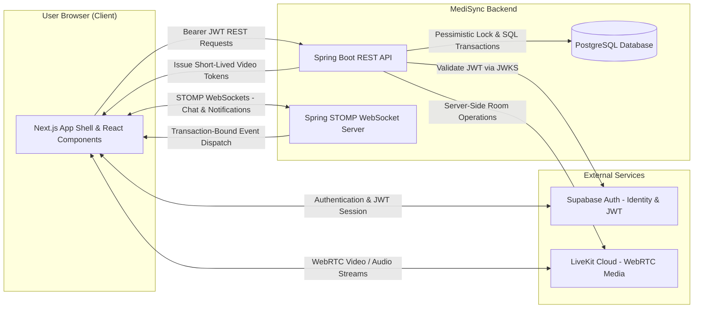
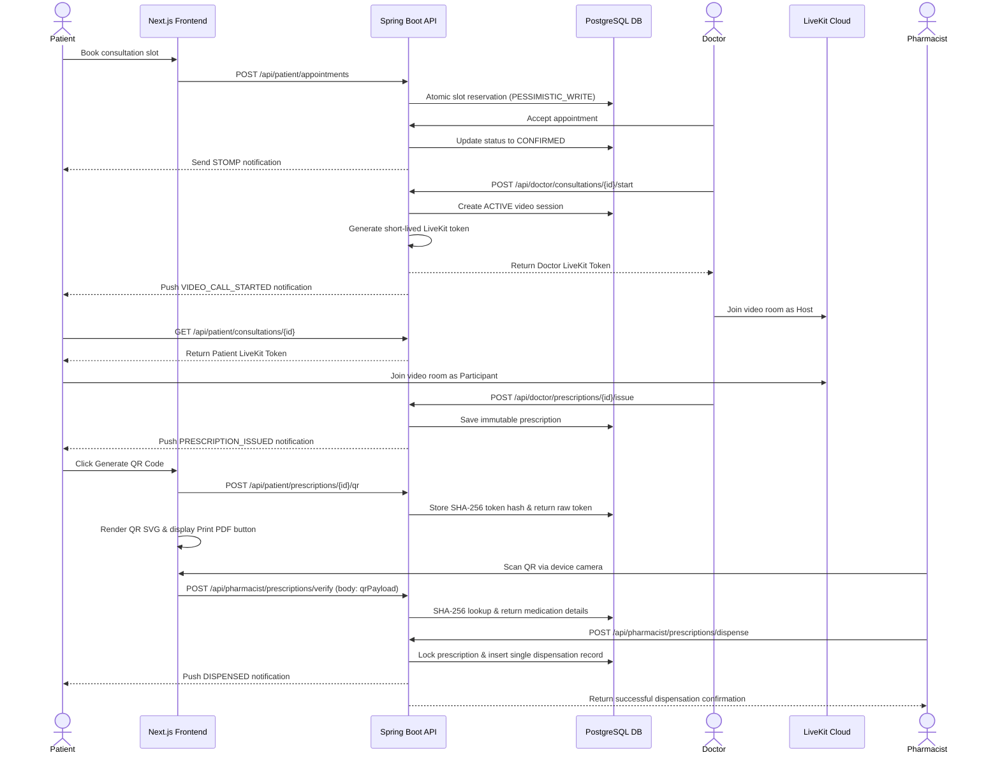
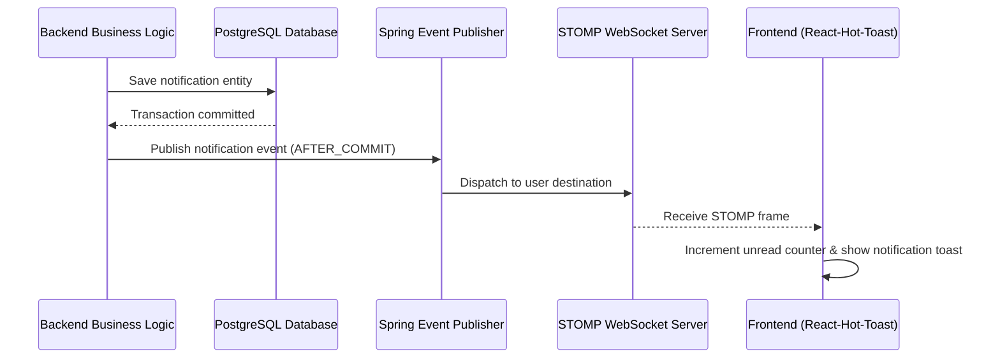

# MediSync Frontend

MediSync is a full-stack digital healthcare management platform that connects Patients, verified Doctors, Pharmacists, and Administrators through a secure end-to-end workflow. 

The frontend is a modern Next.js 16 (App Router) application written in TypeScript and styled with Tailwind CSS v4. It delivers role-specific portals for Patients, Doctors, Pharmacists, and Administrators, featuring realtime Patient–Doctor messaging, secure LiveKit WebRTC video consultations, digital prescription token generation (with printable PDF sheet support), external payment confirmation management, camera-based QR pharmacy scanning, and real-time notification popups.

---

## Technology Stack

| Category | Technology / Library | Version | Purpose |
| :--- | :--- | :--- | :--- |
| **Framework** | Next.js (App Router) | `16.3.1` | React framework for SSR, static page generation, and optimized client routing |
| **Language** | TypeScript | `6.0.3` | Type-safe application development across components, hooks, and API clients |
| **UI Library** | React & React DOM | `19.2.8` | Core component framework with modern hooks and state management |
| **Styling** | Tailwind CSS | `4.3.3` | Utility-first CSS framework with modern color tokens, grid, and flex layouts |
| **Typography & Icons** | Geist & Lucide React | `1.7.2` / `1.33.0` | Custom variable typography and high-fidelity interface icons |
| **Authentication** | `@supabase/supabase-js` / `@supabase/ssr` | `2.112.3` / `0.12.4` | Browser session management, JWT authentication, and OAuth/Email auth flow |
| **Realtime WebSockets** | `@stomp/stompjs` | `7.2.1` | STOMP client over WebSockets for live consultation messaging and notifications |
| **Video Consultation** | `@livekit/components-react` / `livekit-client` | `2.9.24` / `2.22.0` | High-definition WebRTC video/audio streaming components |
| **QR Code Generation** | `qrcode.react` | `4.2.0` | Client-side vector SVG rendering of single-use prescription QR tokens |
| **QR Code Scanning** | `html5-qrcode` | `2.3.8` | Device camera stream scanning and barcode processing for Pharmacists |
| **UI Notifications** | `react-hot-toast` | `2.6.0` | Non-blocking realtime toast alerts for appointment and prescription events |

---

## Key Features

- **Role-Based Healthcare Portals**: Dedicated, isolated workspaces for Patients, Doctors, Pharmacists, and Administrators.
- **Doctor Discovery & Filtering**: Search active, verified medical practitioners by specialty, hospital, department, or doctor name.
- **Appointment Slot Reservation**: Book online video consultations with real-time slot availability, minimum lead-time validation, and symptom intake submission.
- **Doctor-Controlled LiveKit Video Consultations**: Secure, room-isolated WebRTC video calls initiated by Doctors only after scheduled consultation times.
- **Realtime Patient–Doctor Chat**: Persistent consultation-scoped messaging supporting up to four private image/receipt attachments per message.
- **Digital Prescriptions**: Structured medication drafting, issuance, and PDF rendering by verified medical professionals.
- **Printable Prescription PDF**: Print physical paper prescriptions containing embedded QR codes for presentation at traditional pharmacy counters.
- **Single-Use QR Tokens**: On-demand 256-bit cryptographically secure QR code generation for digital or printed presentation.
- **Pharmacist Camera QR Scanner**: Camera-integrated barcode verification and single-click whole-prescription dispensing.
- **External Payment Confirmation Flow**: Manual payment guidance and Doctor-managed payment verification for positive-fee consultations/prescriptions.
- **Realtime STOMP Notification System**: Live header notification bell with unread badge counters and pop-up toasts for critical clinical events.
- **Administrative Governance**: Professional doctor/pharmacist license verification, account access governance, append-only audit logging, and platform analytics.

---

## Role Capabilities Matrix

| Capability | Patient | Doctor | Pharmacist | Admin |
| :--- | :---: | :---: | :---: | :---: |
| Search Verified Doctors & View Slots | ✓ | — | — | — |
| Book Consultation & Submit Symptoms | ✓ | — | — | — |
| Accept / Reject / Cancel Booking | — | ✓ | — | — |
| Start LiveKit Video Consultation | — | ✓ | — | — |
| Join LiveKit Video Consultation | ✓ (if active) | ✓ | — | — |
| Consultation Chat & Image Attachment | ✓ | ✓ | — | — |
| Write Private Clinical Notes | — | ✓ | — | — |
| Issue Digital Prescription | — | ✓ | — | — |
| Confirm External Payment Receipt | — | ✓ | — | — |
| Generate QR Code & Print PDF Sheet | ✓ | — | — | — |
| Camera Scan & Verify QR Token | — | — | ✓ | — |
| Dispense Whole Prescription | — | — | ✓ | — |
| Verify Doctor / Pharmacist Licenses | — | — | — | ✓ |
| View System Analytics & Audit Logs | — | — | — | ✓ |

---

## End-to-End Healthcare Workflow

```
Patient Registration & Onboarding
       │
       ▼
Doctor Discovery (Search by Specialty / Department)
       │
       ▼
Select Available Time Slot & Submit Symptom Form
       │
       ▼
Doctor Accepts Appointment Request
       │
       ▼
Scheduled Consultation Time Arrives
       │
       ▼
Doctor Starts LiveKit Video Call ──► Patient Receives Realtime Notification & Joins
       │
       ▼
Patient & Doctor Consult via WebRTC Video & Persistent Chat
       │
       ▼
Doctor Drafts & Issues Digital Prescription
       │
       ├─────────────────────────────────┐
       ▼                                 ▼
 Fee Required (Positive Fee)         Zero-Fee Consultation
       │                                 │
 Patient Uploads Payment Receipt         │
       │                                 │
 Doctor Confirms Payment Receipt         │
       │                                 │
       └────────────────┬────────────────┘
                        │
                        ▼
    Patient Generates Secure QR Code / Prints PDF Sheet
                        │
                        ▼
 Patient Presents Mobile Phone Screen OR Printed PDF Sheet to Pharmacist
                        │
                        ▼
 Verified Pharmacist Scans QR Code via Camera Scanner
                        │
                        ▼
 Spring Boot API Validates Token Hash & Displays Safe Medication Details
                        │
                        ▼
 Pharmacist Dispenses Prescription (Single-Use Token Voided Permanently)
```

---

## Mermaid Workflow Diagram


---

## System Architecture



---

## Sequence Diagram



---

## LiveKit Video Consultation Architecture

- **WebRTC Cloud Infrastructure**: Audio and video media flows directly between user browsers and LiveKit Cloud via encrypted WebRTC connections.
- **Backend-Only Security**: LiveKit API keys and secrets remain strictly on the Spring Boot backend server; they are never exposed to client-side code.
- **Doctor Access Control**: Only the assigned Doctor can start a video session, and only after the scheduled appointment start time.
- **Patient Join Permission**: Patients cannot create or start video calls. A Patient receives a short-lived token to join only after the Doctor has started the video room.
- **Opaque Identifiers**: Room names and identity tokens use non-PII opaque identifiers.
- **Independent Messaging**: LiveKit native chat is disabled. Consultation communication takes place through MediSync's persistent, database-backed chat system.
- **No Video Recording**: In accordance with medical privacy guidelines, video sessions are live-only and are neither recorded nor stored.

---

## Real-Time Communication Architecture

MediSync uses a STOMP-over-WebSocket protocol (`/ws`) for instant interactive messaging and system notifications.

1. **Consultation Chat**: 
   - Patient and Doctor subscribe to `/user/queue/consultation-events`.
   - Message delivery is transaction-bound: messages are saved to PostgreSQL via REST API before STOMP events are dispatched, ensuring zero message loss.
   - Image and receipt attachments use short-lived pre-signed URLs generated by the API.
2. **System Notifications**:
   - Authenticated clients subscribe to `/user/queue/notifications`.
   - real-time notifications update the top navigation bar Bell badge and trigger interactive pop-up toasts via `react-hot-toast`.
   - Unread counts and notification state are persisted in PostgreSQL, enabling offline users to view unread notifications upon logging in.



---

## Digital Prescription & QR Workflow

1. **Prescription Issuance**: Verified Doctors create structured digital prescriptions containing medication names, dosages, frequencies, durations, and special instructions.
2. **Printable PDF & Digital QR**: Patients can access their issued prescription in two formats:
   - **Digital QR Code**: Generated on-demand as a 256-bit cryptographically random token rendered into a clean QR barcode using `qrcode.react`.
   - **Printable PDF Sheet**: A clean, printable document layout including prescription details and the embedded QR code for presentation at traditional pharmacies.
3. **Token Hash Security**: The raw QR payload exists only in memory during the session. PostgreSQL stores only the SHA-256 hash of the token.
4. **Single-Use Dispensing**: Scanning the QR code at a partner pharmacy invokes the backend verification endpoint. Once dispensed, the single-use token is voided permanently, preventing re-dispensing or QR reuse.

---

## External Payment Workflow

MediSync provides a transparent external payment verification flow for positive-fee consultations:

1. **Payment Instructions**: The Doctor sets the consultation/prescription fee and provides payment guidance (e.g., bank transfer details).
2. **Receipt Submission**: The Patient completes payment externally and uploads the receipt image directly within the consultation chat.
3. **Doctor Confirmation**: The assigned Doctor reviews the receipt and clicks **Confirm Payment** (`POST /api/doctor/prescriptions/{id}/confirm-payment`).
4. **QR Unlocking**: Upon payment confirmation, the prescription status updates and the **Generate QR Code** and **Print PDF** buttons are unlocked for the Patient.
5. **Zero-Fee Exception**: Prescriptions marked with a zero fee automatically bypass payment confirmation and are instantly eligible for QR generation.

---

## Complete Application Screens & Route Directory

### Public & Authentication Routes
| Route | Screen / Purpose |
| :--- | :--- |
| `/` | Modernized MediSync Homepage (Hero, Features, Workflows, FAQ Accordion) |
| `/about` | Platform mission, clinical standards, trust pillars, and team values |
| `/features` | Core feature showcase for Patients, Doctors, Pharmacists, and Administrators |
| `/guides` | Step-by-step user manuals and workflow guides |
| `/login` | User login screen supporting Supabase Email/Password authentication |
| `/register` | User account registration |
| `/onboarding` | Role selection (Patient, Doctor, Pharmacist) and profile initialization |

### Patient Workspace (`/patient/*`)
| Route | Screen / Purpose |
| :--- | :--- |
| `/patient/dashboard` | Care summary, upcoming appointments, and quick action cards |
| `/patient/doctors` | Search verified Doctors with specialty and hospital filters |
| `/patient/doctors/[doctorId]` | View Doctor profile, select available time slots, and submit symptoms |
| `/patient/appointments` | List of requested, confirmed, and past consultation bookings |
| `/patient/consultations/[id]` | Consultation workspace: LiveKit video room, real-time chat, and history |
| `/patient/prescriptions` | Issued digital prescriptions and dispensing status |
| `/patient/prescriptions/[id]` | Prescription detail view, QR code generator, and printable PDF view |
| `/patient/notifications` | Persistent notification history and unread message center |
| `/patient/profile` | Personal profile management and phone number updates |

### Doctor Workspace (`/doctor/*`)
| Route | Screen / Purpose |
| :--- | :--- |
| `/doctor/dashboard` | Clinical overview, daily schedule, and urgent patient requests |
| `/doctor/availability` | Create date-based availability windows, block/unblock time slots |
| `/doctor/appointments` | Review pending consultation requests (Accept, Reject, Cancel) |
| `/doctor/consultations/[id]` | Clinical workspace: Video controls, chat, symptom intake, and private notes |
| `/doctor/prescriptions` | Digital prescription history and active draft manager |
| `/doctor/prescriptions/[id]` | Prescription editor, medication item builder, and issue confirmation |
| `/doctor/notifications` | Real-time appointment and payment notifications |
| `/doctor/profile` | Professional verification profile, license details, and status review |

### Pharmacist Workspace (`/pharmacist/*`)
| Route | Screen / Purpose |
| :--- | :--- |
| `/pharmacist/dashboard` | Pharmacy operational dashboard and dispensing statistics |
| `/pharmacist/scan` | Live camera QR code scanner, payload verification, and dispensing confirmation |
| `/pharmacist/dispensing-history` | Audit log of past dispensations executed by the pharmacist |
| `/pharmacist/notifications` | Account status and platform notifications |
| `/pharmacist/profile` | Pharmacy license submission and verification status management |

### Administrator Workspace (`/admin/*`)
| Route | Screen / Purpose |
| :--- | :--- |
| `/admin/dashboard` | Governance dashboard, pending verifications, and system health metrics |
| `/admin/users` | User directory with account status controls (Ban / Unban) |
| `/admin/verifications` | Professional verification queue for Doctor and Pharmacist applications |
| `/admin/hospitals` | Master directory of affiliated hospitals and clinical institutions |
| `/admin/departments` | Master directory of medical departments |
| `/admin/specializations` | Master directory of medical specialties |
| `/admin/analytics` | Platform utilization metrics, consultation trends, and user activity |
| `/admin/audit-logs` | Filterable append-only system audit log |

---

## Project Structure

```text
d:/MediSync/frontend/
├── public/                     # Static public assets and branding graphics
├── src/
│   ├── app/                    # Next.js 16 App Router pages and layouts
│   │   ├── (auth)/             # Authentication routes (login, register, onboarding)
│   │   ├── about/              # About MediSync page
│   │   ├── admin/              # Administrator portal pages
│   │   ├── doctor/             # Doctor clinical portal pages
│   │   ├── features/           # Platform features overview page
│   │   ├── guides/             # End-to-end user manuals page
│   │   ├── patient/            # Patient care portal pages
│   │   ├── pharmacist/         # Pharmacist dispensing portal pages
│   │   ├── globals.css         # Tailwind CSS v4 design tokens and global styles
│   │   ├── layout.tsx          # Root application layout wrapper
│   │   └── page.tsx            # Modernized public homepage
│   ├── components/             # Reusable UI components
│   │   ├── auth-card.tsx       # Standardized authentication container styles
│   │   ├── auth-provider.tsx   # React Auth context and Supabase session listener
│   │   ├── faq-accordion.tsx   # Smooth height-animated light-box FAQ accordion
│   │   ├── loading-panel.tsx   # Animated loading indicators
│   │   ├── layout/             # App shell, top navigation bar, and sidebar
│   │   ├── notifications/      # Realtime notification context, bell, and toast UI
│   │   └── public/             # Navbar, footer, and marketing components
│   ├── hooks/                  # Custom React hooks (STOMP WebSocket, media queries)
│   ├── lib/                    # API client, Supabase browser client, and utils
│   └── types/                  # TypeScript domain interfaces and DTO declarations
├── .env.example                # Safe environment variable configuration template
├── package.json                # Frontend dependencies and npm scripts
├── tsconfig.json               # TypeScript compiler configuration
└── next.config.ts              # Next.js runtime configuration
```

---

## Environment Variables

Create `.env.local` in `D:\MediSync\frontend\` using the template below. **Do not include actual production secrets.**

```env
# Supabase Authentication (Client-Safe Public Keys)
NEXT_PUBLIC_SUPABASE_URL=https://your-project-id.supabase.co
NEXT_PUBLIC_SUPABASE_ANON_KEY=your_supabase_anon_key_here

# Backend Spring Boot API Endpoint
NEXT_PUBLIC_API_BASE_URL=http://localhost:8080
```

> **Security Note**: Only variables prefixed with `NEXT_PUBLIC_` are exposed to the browser. Database credentials, LiveKit API secrets, and Supabase service-role keys must **never** be placed in the frontend configuration.

---

## Installation & Running Locally

### Prerequisites
- **Node.js**: v20.9.0 or newer
- **npm**: v10.0.0 or newer
- **MediSync API**: Running locally on `http://localhost:8080` (or configured API URL)

### 1. Clone & Install
```powershell
cd D:\MediSync\frontend
npm install
```

### 2. Configure Environment
```powershell
copy .env.example .env.local
```
Fill in your `NEXT_PUBLIC_SUPABASE_URL` and `NEXT_PUBLIC_SUPABASE_ANON_KEY`.

### 3. Start Development Server
```powershell
npm run dev
```
Open `http://localhost:3000` in your web browser.

---

## Quality Commands

```powershell
# Run ESLint validation
npm run lint

# Run TypeScript type check
npm run typecheck

# Execute Next.js production build verification
npm run build
```

---

## Security & Privacy Safeguards

- **JWT Session Tokens**: Authenticated requests attach Supabase Bearer tokens in the `Authorization` header.
- **Client-Side Authorization Enforcement**: Route middleware and component checks restrict portal access to matching verified roles (`PATIENT`, `DOCTOR`, `PHARMACIST`, `ADMIN`).
- **Memory-Only QR Token Storage**: Raw prescription QR token payloads exist solely in component state during active display and are cleared immediately after rendering or dispensing.
- **Transient Media Links**: Consultation chat attachments and profile photos use short-lived pre-signed URLs; raw storage buckets remain private.
- **Admin Clinical Privacy**: System administrators can manage user accounts and verifications but have no access to clinical consultation notes, patient–doctor chat messages, or prescription QR secrets.

---

## Companion Backend Repository

The backend source code is located in the companion repository:  
📁 [`D:\MediSync\backend`](../backend/README.md) — Spring Boot 3.5 API with PostgreSQL, STOMP WebSockets, and LiveKit Java Server SDK.

---

## License & Project Context

MediSync was designed and built as a full-stack digital healthcare platform for modern remote healthcare delivery. All core features including professional verification, video consultations, persistent chat, digital prescribing, external payment confirmation, and single-use QR dispensing are implemented.
