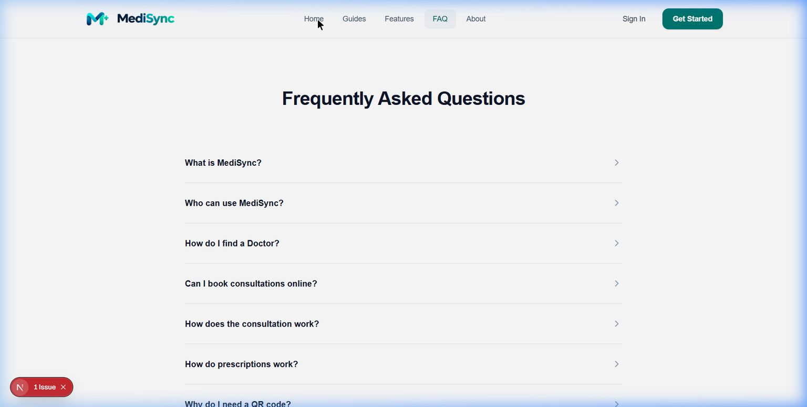
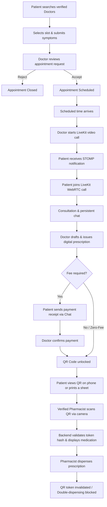
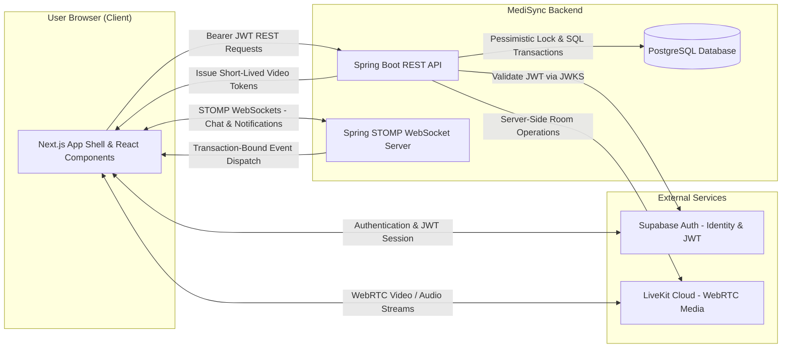
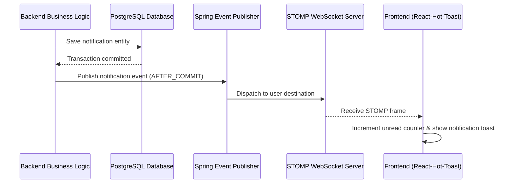

# MediSync Frontend

MediSync is a full-stack healthcare workflow project for Patients, verified Doctors, verified Pharmacists, and Administrators. It addresses the fragmentation between appointment booking, remote consultation, prescriptions, external-payment evidence, and pharmacy fulfillment by presenting them as one role-aware journey.

This repository contains the Next.js 16 App Router client. It combines Supabase browser authentication, typed Spring Boot API access, persistent STOMP updates, LiveKit WebRTC rooms, print-ready prescriptions, and camera-based QR verification across four responsive portals. The backend remains authoritative for identity, roles, ownership, verification, lifecycle rules, and sensitive token generation.

> MediSync is an engineering portfolio project, not a certified medical product or a claim of deployment in a hospital environment.

---

## Technology Stack

| Category | Technology / Library | Version | Purpose |
| :--- | :--- | :--- | :--- |
| **Framework** | Next.js (App Router) | `16.3.1` | React framework for SSR, static page generation, and optimized client routing |
| **Language** | TypeScript | `6.0.3` | Type-safe application development across components, hooks, and API clients |
| **UI Library** | React & React DOM | `19.2.8` | Core component framework with modern hooks and state management |
| **Styling** | Tailwind CSS | `4.3.3` | Utility-first CSS framework with modern color tokens, grid, and flex layouts |
| **Typography & Icons** | Geist & Lucide React | `1.7.2` / `1.33.0` | Custom variable typography and high-fidelity interface icons |
| **Authentication** | `@supabase/supabase-js` / `@supabase/ssr` | `2.112.3` / `0.12.4` | Browser session management, JWT authentication, and OAuth/Email auth flow |
| **Realtime WebSockets** | `@stomp/stompjs` | `7.2.1` | STOMP client over WebSockets for live consultation messaging and notifications |
| **Video Consultation** | `@livekit/components-react` / `livekit-client` | `2.9.24` / `2.22.0` | High-definition WebRTC video/audio streaming components |
| **QR Code Generation** | `qrcode.react` | `4.2.0` | Client-side vector SVG rendering of single-use prescription QR tokens |
| **QR Code Scanning** | `html5-qrcode` | `2.3.8` | Device camera stream scanning and barcode processing for Pharmacists |
| **UI Notifications** | `react-hot-toast` | `2.6.0` | Non-blocking realtime toast alerts for appointment and prescription events |

---

## Design System & Themes



* **Color Palette**: Primary Teal (`#0F766E`), Secondary Emerald (`#10B981`), Tertiary Blue (`#0EA5E9`), and Neutral Slate (`#64748B`).
* **Typography**: **Geist** for headlines, labels, and UI controls; **Hanken Grotesk** for body text and medical records.
* **Component Styling**: High-contrast modern UI controls, rounded card containers, search bars, action buttons, and clean tonal depth.

---

## Key Features

- **Role-Based Healthcare Portals**: Dedicated, isolated workspaces for Patients, Doctors, Pharmacists, and Administrators.
- **Doctor Discovery & Filtering**: Search active, verified medical practitioners by specialty, hospital, department, or doctor name.
- **Appointment Slot Reservation**: Book online video consultations with real-time slot availability, minimum lead-time validation, and symptom intake submission.
- **Doctor-Controlled LiveKit Video Consultations**: Secure, room-isolated WebRTC video calls initiated by Doctors only after scheduled consultation times.
- **Realtime Patient–Doctor Chat**: Persistent consultation-scoped messaging supporting up to four private image/receipt attachments per message.
- **Digital Prescriptions**: Structured medication drafting and issuance by verified medical professionals.
- **Print-Ready Prescription**: Browser print layout containing prescription details and an embedded QR code for presentation at a pharmacy counter.
- **Single-Use QR Tokens**: On-demand 256-bit cryptographically secure QR code generation for digital or printed presentation.
- **Pharmacist Camera QR Scanner**: Camera-integrated barcode verification and single-click whole-prescription dispensing.
- **External Payment Confirmation Flow**: Manual payment guidance and Doctor-managed payment verification for positive-fee consultations/prescriptions.
- **Realtime STOMP Notification System**: Live header notification bell with unread badge counters and pop-up toasts for critical clinical events.
- **Administrative Governance**: Professional doctor/pharmacist license verification, account access governance, append-only audit logging, and platform analytics.

---

## Role Capabilities Matrix

| Capability | Patient | Doctor | Pharmacist | Admin |
| :--- | :---: | :---: | :---: | :---: |
| Search Verified Doctors & View Slots | ✓ | — | — | — |
| Book Consultation & Submit Symptoms | ✓ | — | — | — |
| Accept / Reject / Cancel Booking | — | ✓ | — | — |
| Start LiveKit Video Consultation | — | ✓ | — | — |
| Join LiveKit Video Consultation | ✓ (if active) | ✓ | — | — |
| Consultation Chat & Image Attachment | ✓ | ✓ | — | — |
| Write Private Clinical Notes | — | ✓ | — | — |
| Issue Digital Prescription | — | ✓ | — | — |
| Confirm External Payment Receipt | — | ✓ | — | — |
| Mark External Payment Sent | ✓ | — | — | — |
| Generate QR Code & Print Sheet | ✓ | — | — | — |
| Camera Scan & Verify QR Token | — | — | ✓ | — |
| Dispense Whole Prescription | — | — | ✓ | — |
| Verify Doctor / Pharmacist Licenses | — | — | — | ✓ |
| View System Analytics & Audit Logs | — | — | — | ✓ |

---

## End-to-End Healthcare Workflow

```
Patient Registration & Onboarding
       │
       ▼
Doctor Discovery (Search by Specialty / Department)
       │
       ▼
Select Available Time Slot & Submit Symptom Form
       │
       ▼
Doctor Accepts Appointment Request
       │
       ▼
Scheduled Consultation Time Arrives
       │
       ▼
Doctor Starts LiveKit Video Call ──► Patient Receives Realtime Notification & Joins
       │
       ▼
Patient & Doctor Consult via WebRTC Video & Persistent Chat
       │
       ▼
Doctor Drafts & Issues Digital Prescription
       │
       ├─────────────────────────────────┐
       ▼                                 ▼
 Fee Required (Positive Fee)         Zero-Fee Consultation
       │                                 │
 Patient Uploads Payment Receipt         │
       │                                 │
 Doctor Confirms Payment Receipt         │
       │                                 │
       └────────────────┬────────────────┘
                        │
                        ▼
    Patient Generates Secure QR Code / Prints Prescription Sheet
                        │
                        ▼
 Patient Presents Mobile Phone Screen OR Printed Sheet to Pharmacist
                        │
                        ▼
 Verified Pharmacist Scans QR Code via Camera Scanner
                        │
                        ▼
 Spring Boot API Validates Token Hash & Displays Safe Medication Details
                        │
                        ▼
 Pharmacist Dispenses Prescription (Single-Use Token Voided Permanently)
```

---

## Mermaid Workflow Diagram



---

## System Architecture



---

## Sequence Diagram

```mermaid
sequenceDiagram
    actor P as Patient
    participant FE as Next.js Frontend
    participant BE as Spring Boot API
    participant DB as PostgreSQL DB
    actor D as Doctor
    participant LK as LiveKit Cloud
    actor PH as Pharmacist

    P->>FE: Select slot and submit symptoms
    FE->>BE: POST /api/patient/appointments
    BE->>DB: Lock Patient and slot; create request

    D->>BE: POST /api/doctor/appointments/{id}/accept
    BE->>DB: Confirm booking and create consultation
    BE-->>P: Private appointment notification

    D->>BE: POST /api/doctor/consultations/{id}/start
    D->>BE: POST /api/doctor/consultations/{id}/video/start
    BE->>DB: Create one ACTIVE video session
    BE-->>D: Short-lived token and LiveKit URL
    D->>LK: Join opaque room
    BE-->>P: VIDEO_CALL_STARTED notification
    P->>BE: POST /api/patient/consultations/{id}/video/join
    BE-->>P: Short-lived token and LiveKit URL
    P->>LK: Join same opaque room

    D->>BE: POST /api/doctor/prescriptions/{id}/issue
    BE->>DB: Persist issued prescription
    alt Positive fee
        P->>BE: POST /api/patient/consultations/{id}/payment-sent
        BE-->>D: PAYMENT_SENT notification
        D->>BE: POST /api/doctor/prescriptions/{id}/confirm-payment
    else Zero fee
        BE->>DB: Payment NOT_REQUIRED
    end

    P->>FE: Generate QR
    FE->>BE: POST /api/patient/prescriptions/{id}/qr
    BE->>DB: Store SHA-256 token hash
    BE-->>FE: Return raw token for in-memory QR rendering
    PH->>FE: Scan QR with device camera
    FE->>BE: POST /api/pharmacist/prescriptions/verify
    BE->>DB: Hash lookup; return safe prescription view
    PH->>BE: POST /api/pharmacist/prescriptions/dispense
    BE->>DB: Lock, dispense once, and revoke token
    BE-->>P: DISPENSED notification
```

---

## LiveKit Video Consultation Architecture

- **WebRTC Cloud Infrastructure**: Audio and video media flows directly between user browsers and LiveKit Cloud via encrypted WebRTC connections.
- **Backend-Only Security**: LiveKit API keys and secrets remain strictly on the Spring Boot backend server; they are never exposed to client-side code.
- **Doctor Access Control**: Only the assigned Doctor can start a video session, and only after the scheduled appointment start time.
- **Patient Join Permission**: Patients cannot create or start video calls. A Patient receives a short-lived token to join only after the Doctor has started the video room.
- **Opaque Identifiers**: Room names and identity tokens use non-PII opaque identifiers.
- **Independent Messaging**: Durable clinical conversation remains in MediSync's persistent, database-backed chat rather than LiveKit room metadata.
- **Lifecycle**: Completing or cancelling a consultation ends its video-session state and the backend requests room deletion.
- **No Video Recording**: Video sessions are live-only; the project does not implement recording or storage.

---

## Real-Time Communication Architecture

MediSync uses a STOMP-over-WebSocket protocol (`/ws`) for instant interactive messaging and system notifications.

1. **Consultation Chat**: 
   - Patient and Doctor subscribe to `/user/queue/consultation-events`.
   - Message delivery is transaction-bound: messages are saved to PostgreSQL via REST API before STOMP events are dispatched, ensuring zero message loss.
   - Image and receipt attachments use short-lived pre-signed URLs generated by the API.
2. **System Notifications**:
   - Authenticated clients subscribe to `/user/queue/notifications`.
   - real-time notifications update the top navigation bar Bell badge and trigger interactive pop-up toasts via `react-hot-toast`.
   - Unread counts and notification state are persisted in PostgreSQL, enabling offline users to view unread notifications upon logging in.



---

## Digital Prescription & QR Workflow

1. **Prescription Issuance**: Verified Doctors create structured digital prescriptions containing medication names, dosages, frequencies, durations, and special instructions.
2. **Print Layout & Digital QR**: Patients can access their issued prescription in two formats:
   - **Digital QR Code**: Generated on-demand as a 256-bit cryptographically random token rendered into a clean QR barcode using `qrcode.react`.
   - **Printable Sheet**: A browser print layout including prescription details and the embedded QR code.
3. **Token Hash Security**: The raw QR payload exists only in memory during the session. PostgreSQL stores only the SHA-256 hash of the token.
4. **Single-Use Dispensing**: Scanning the QR code at a partner pharmacy invokes the backend verification endpoint. Once dispensed, the single-use token is voided permanently, preventing re-dispensing or QR reuse.

---

## External Payment Workflow

MediSync provides a transparent external payment verification flow for positive-fee consultations:

1. **Payment Instructions**: The Doctor sets the consultation/prescription fee and provides payment guidance (e.g., bank transfer details).
2. **Receipt Submission**: The Patient completes payment externally and uploads the receipt image directly within the consultation chat.
3. **Doctor Confirmation**: The assigned Doctor reviews the receipt and clicks **Confirm Payment** (`POST /api/doctor/prescriptions/{id}/confirm-payment`).
4. **QR Unlocking**: Upon payment confirmation, the prescription status updates and QR generation/printing becomes available to the Patient.
5. **Zero-Fee Exception**: Prescriptions marked with a zero fee automatically bypass payment confirmation and are instantly eligible for QR generation.

---

## Complete Application Screens & Route Directory

### Public & Authentication Routes
| Route | Screen / Purpose |
| :--- | :--- |
| `/` | Modernized MediSync Homepage (Hero, Features, Workflows, FAQ Accordion) |
| `/about` | Platform mission, clinical standards, trust pillars, and team values |
| `/features` | Core feature showcase for Patients, Doctors, Pharmacists, and Administrators |
| `/guides` | Step-by-step user manuals and workflow guides |
| `/login` | User login screen supporting Supabase Email/Password authentication |
| `/register` | User account registration |
| `/onboarding` | Role selection (Patient, Doctor, Pharmacist) and profile initialization |
| `/forgot-password` | Password recovery request |
| `/update-password` | Password reset completion |
| `/account-restricted` | Pending, rejected, or banned account guidance |
| `/account-deleted` | Deleted-account confirmation |

### Patient Workspace (`/patient/*`)
| Route | Screen / Purpose |
| :--- | :--- |
| `/patient/dashboard` | Care summary, upcoming appointments, and quick action cards |
| `/patient/doctors` | Search verified Doctors with specialty and hospital filters |
| `/patient/doctors/[doctorId]` | View Doctor profile, select available time slots, and submit symptoms |
| `/patient/appointments` | List of requested, confirmed, and past consultation bookings |
| `/patient/consultations/[id]` | Consultation workspace: LiveKit video room, real-time chat, and history |
| `/patient/prescriptions` | Issued digital prescriptions and dispensing status |
| `/patient/prescriptions/[id]` | Prescription detail view, QR generator, and print-ready sheet |
| `/patient/notifications` | Persistent notification history and unread message center |
| `/patient/profile` | Personal profile management and phone number updates |

### Doctor Workspace (`/doctor/*`)
| Route | Screen / Purpose |
| :--- | :--- |
| `/doctor/dashboard` | Clinical overview, daily schedule, and urgent patient requests |
| `/doctor/availability` | Create date-based availability windows, block/unblock time slots |
| `/doctor/appointments` | Review pending consultation requests (Accept, Reject, Cancel) |
| `/doctor/consultations/[id]` | Clinical workspace: Video controls, chat, symptom intake, and private notes |
| `/doctor/prescriptions` | Digital prescription history and active draft manager |
| `/doctor/prescriptions/[id]` | Prescription editor, medication item builder, and issue confirmation |
| `/doctor/notifications` | Real-time appointment and payment notifications |
| `/doctor/profile` | Professional verification profile, license details, and status review |

### Pharmacist Workspace (`/pharmacist/*`)
| Route | Screen / Purpose |
| :--- | :--- |
| `/pharmacist/dashboard` | Pharmacy operational dashboard and dispensing statistics |
| `/pharmacist/scan` | Live camera QR code scanner, payload verification, and dispensing confirmation |
| `/pharmacist/dispensing-history` | Audit log of past dispensations executed by the pharmacist |
| `/pharmacist/notifications` | Account status and platform notifications |
| `/pharmacist/profile` | Pharmacy license submission and verification status management |

### Administrator Workspace (`/admin/*`)
| Route | Screen / Purpose |
| :--- | :--- |
| `/admin/dashboard` | Governance dashboard, pending verifications, and system health metrics |
| `/admin/users` | User directory with account status controls (Ban / Unban) |
| `/admin/verification` | Professional verification queue for Doctor and Pharmacist applications |
| `/admin/hospitals` | Master directory of affiliated hospitals and clinical institutions |
| `/admin/departments` | Master directory of medical departments |
| `/admin/specializations` | Master directory of medical specialties |
| `/admin/analytics` | Platform utilization metrics, consultation trends, and user activity |
| `/admin/audit` | Filterable append-only system audit log |
| `/admin/notifications` | Persistent Admin notification history |
| `/admin/profile` | Administrator profile editing |

---

## Screenshots and Design Reference

The repository currently includes the design-system reference shown near the top of this README. Product screenshots have not yet been committed, so this documentation intentionally does not link to invented assets. Recommended future captures are the Patient dashboard, Doctor consultation workspace, LiveKit call, prescription/QR view, Pharmacist verification, and Admin dashboard.

---

## Project Structure

```text
frontend/
├── public/                     # Static public assets and branding graphics
├── src/
│   ├── app/                    # Next.js 16 App Router pages and layouts
│   │   ├── about/              # About MediSync page
│   │   ├── admin/              # Administrator portal pages
│   │   ├── doctor/             # Doctor clinical portal pages
│   │   ├── features/           # Platform features overview page
│   │   ├── guides/             # End-to-end user manuals page
│   │   ├── patient/            # Patient care portal pages
│   │   ├── pharmacist/         # Pharmacist dispensing portal pages
│   │   ├── globals.css         # Tailwind CSS v4 design tokens and global styles
│   │   ├── layout.tsx          # Root application layout wrapper
│   │   └── page.tsx            # Modernized public homepage
│   ├── components/             # Reusable UI components
│   │   ├── auth-card.tsx       # Standardized authentication container styles
│   │   ├── auth-provider.tsx   # React Auth context and Supabase session listener
│   │   ├── faq-accordion.tsx   # Smooth height-animated light-box FAQ accordion
│   │   ├── loading-panel.tsx   # Animated loading indicators
│   │   ├── layout/             # App shell, top navigation bar, and sidebar
│   │   ├── notifications/      # Realtime notification context, bell, and toast UI
│   │   └── public/             # Navbar, footer, and marketing components
│   ├── hooks/                  # Custom React hooks (STOMP WebSocket, media queries)
│   ├── lib/                    # API client, Supabase browser client, and utils
│   └── types/                  # TypeScript domain interfaces and DTO declarations
├── .env.example                # Safe environment variable configuration template
├── package.json                # Frontend dependencies and npm scripts
├── tsconfig.json               # TypeScript compiler configuration
└── next.config.ts              # Next.js runtime configuration
```

---

## Environment Variables

Create `.env.local` in the repository root. The checked-in client reads these names; values are intentionally omitted here.

```env
NEXT_PUBLIC_SUPABASE_URL=
NEXT_PUBLIC_SUPABASE_ANON_KEY=
NEXT_PUBLIC_API_BASE_URL=
NEXT_PUBLIC_API_URL=
```

`NEXT_PUBLIC_API_BASE_URL` is the main API-client setting. `NEXT_PUBLIC_API_URL` is still referenced by the account-deletion request path. Every `NEXT_PUBLIC_*` value is browser-visible: database credentials, Supabase service-role keys, and LiveKit API secrets must never be frontend settings.

---

## Installation & Running Locally

### Prerequisites
- A Node.js version supported by Next.js 16
- npm
- The MediSync backend at the configured API base URL
- Supabase project URL and publishable/anonymous browser key

### 1. Clone & Install
```powershell
cd Medisync-frontend
npm install
```

### 2. Configure Environment
```powershell
copy .env.example .env.local
```
Fill in the Supabase browser settings and backend API URL.

### 3. Start Development Server
```powershell
npm run dev
```
Open `http://localhost:3000` in your web browser.

---

## Quality Commands

```powershell
# Run ESLint validation
npm run lint

# Run TypeScript type check
npm run typecheck

# Execute Next.js production build verification
npm run build
```

---

## Security & Privacy Safeguards

- **JWT Session Tokens**: Authenticated requests attach Supabase Bearer tokens in the `Authorization` header.
- **Defense in Depth**: Client redirects and role-aware navigation improve UX, while the Spring Boot backend—not the browser—authoritatively enforces identity, account status, role, verification, ownership, and state transitions.
- **Private User Realtime**: The STOMP connection uses the access token and subscribes to authenticated user destinations rather than public per-user topics.
- **Backend-Only LiveKit Authority**: The browser receives a short-lived room token from the API; LiveKit API credentials are never frontend variables. Room identities are opaque and no clinical data is placed in provider metadata.
- **Ephemeral QR Display**: The raw prescription QR payload is held in React state for display/printing and is not written to browser storage by this flow; the backend persists only its hash.
- **Transient Media Links**: Consultation chat attachments and profile photos use short-lived pre-signed URLs; raw storage buckets remain private.
- **Admin Clinical Privacy**: System administrators can manage user accounts and verifications but have no access to clinical consultation notes, patient–doctor chat messages, or prescription QR secrets.

---

## Known Limitations

- Video is live-only; recording, transcription, and stored call media are not implemented.
- Payments happen outside MediSync; there is no internal card gateway, refund, or settlement workflow.
- Pharmacy fulfillment is whole-prescription only; partial dispensing is not implemented.
- Insurance, laboratory, and external electronic-health-record integrations are outside the current scope.
- Supabase is required for authentication/private media, LiveKit Cloud for video, and the Spring Boot service for protected workflows.
- No frontend unit or end-to-end test runner is configured in `package.json`; current automated frontend gates are TypeScript, ESLint, and the production build.
- The project is not presented as formally certified for regulatory or clinical production use.

## Future Improvements

- Add Playwright coverage for the four role journeys and accessibility regression checks.
- Add committed, anonymized product screenshots and a short architecture demo.
- Add offline/reconnect UX tests for STOMP notifications and consultation events.
- Consolidate the two API URL environment names into one setting.
- Add CI that runs frontend gates and backend tests together.

---

## Companion Backend Repository

[MediSync Backend](https://github.com/dulanprabashwara/MediSync-backend) contains the Spring Boot API, PostgreSQL/Flyway schema, authorization and lifecycle rules, STOMP delivery, LiveKit token service, and QR/dispensing transactions.

---

## Project Context

MediSync is a serious full-stack engineering and portfolio project demonstrating role-specific product design, typed API integration, realtime state, WebRTC media, and a connected prescription-to-dispensing journey. It is not represented as a real hospital deployment, regulatory certification, or substitute for clinical governance.
